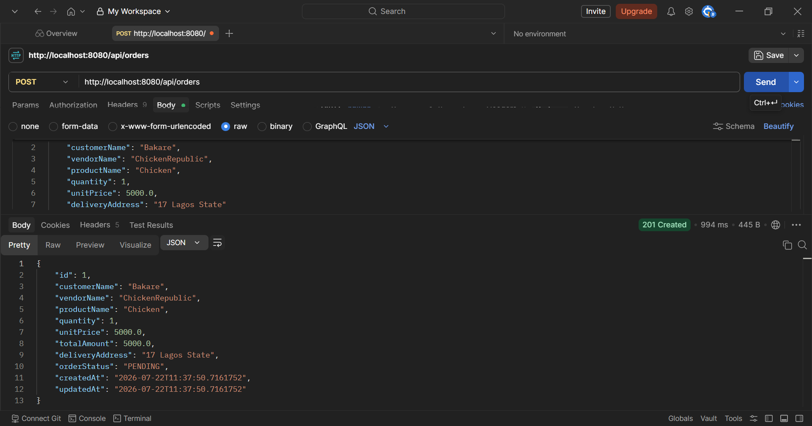
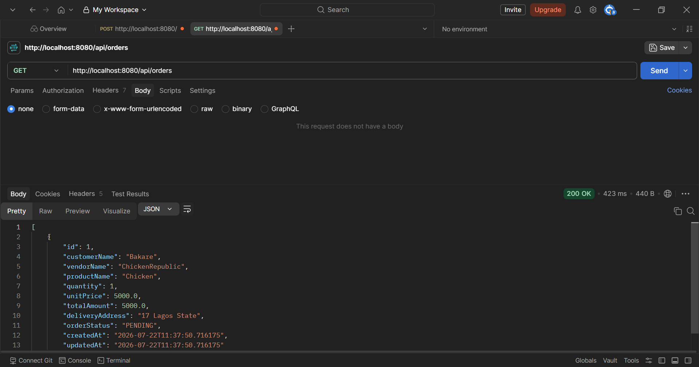
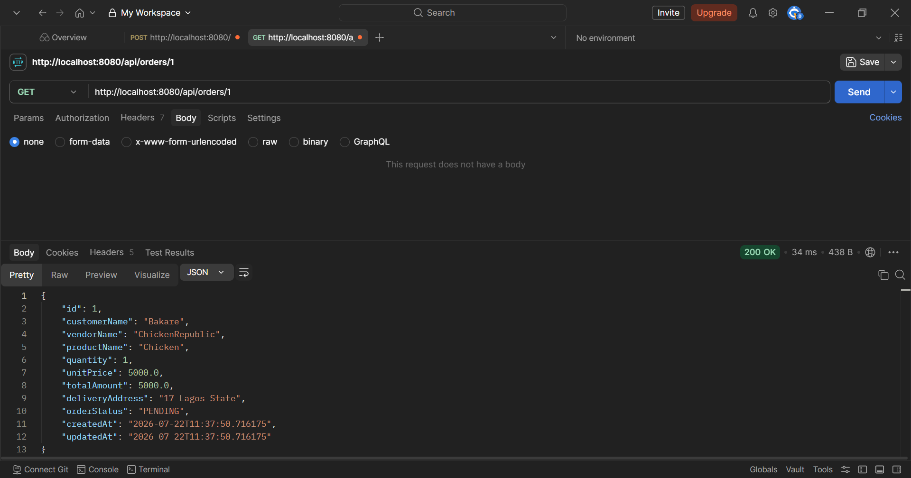
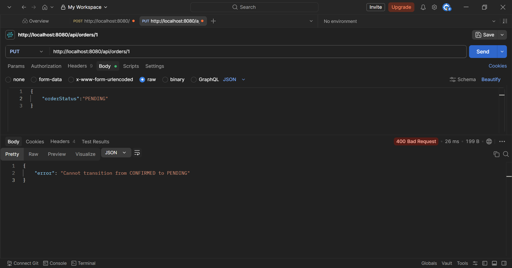
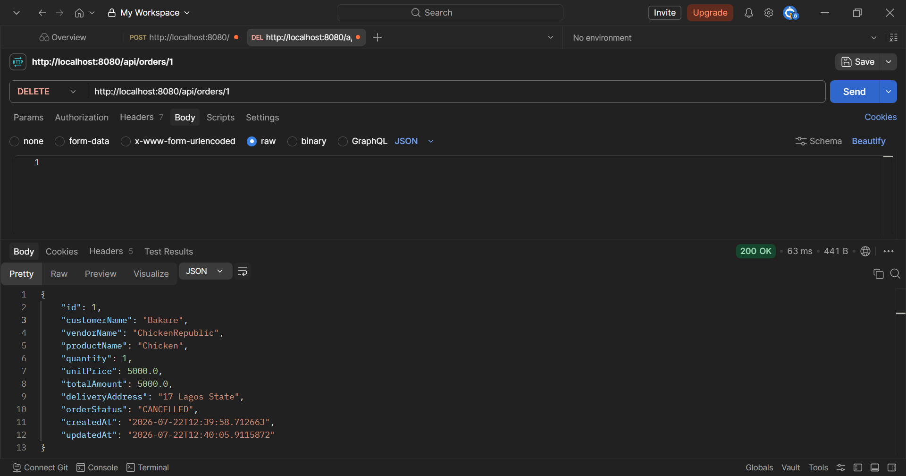

# API Testing Results

All 6 API test cases have been tested and verified working.

## Test Results

### 1. POST /api/orders (Create Order) - 201 Created

### 2. GET /api/orders (Get All Orders) - 200 OK

### 3. GET /api/orders/{id} (Get Single Order) - 200 OK

### 4. PUT /api/orders/{id} (Update Status - Valid) - 200 OK

### 5. PUT /api/orders/{id} (Update Status - Invalid) - 400 Bad Request

### 6. DELETE /api/orders/{id} (Cancel Order) - 200 OK

All tests demonstrate:
- Correct HTTP status codes
- Proper JSON response formatting
- Order status validation
- Error handling
